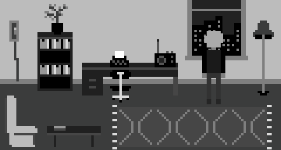

# *Eveline*

# [Play Online](https://www.pippinbarr.com/eveline/) (desktop)

## Description
*There's a great novelist inside all of us! Especially you! You just need to get started! Write! Read! Write-read! What is that?! Find out!*

_Eveline_ was written in JavaScript/HTML5 using the Phaser game framework. Sounds were created using [bfxr](http://www.bfxr.net/) and [Audacity](http://www.audacityteam.org/). Music was created in [Bosca Ceoil](http://boscaceoil.net/).

## Documentation
* Read the [Process Documentation](../process)
* Look at the [Code Repository](https://github.com/pippinbarr/eveline) for source code etc.

## Press
Read the [Press Kit](../press) for press information

* [Kill Screen](https://killscreen.com/articles/a-videogame-that-tricks-you-into-reading-literature/)
* [Gadgette](http://www.gadgette.com/2016/03/24/this-game-simulates-the-experience-of-being-a-writer/)
* [The Next Web](http://thenextweb.com/shareables/2016/03/25/eveline-browser-game/)
* [IndieGames.com](http://indiegames.com/2016/03/write_with_eveline.html), [Anait](http://www.anaitgames.com/articulos/eveline) (in Spanish), [24.hu](http://24.hu/tech/2016/03/29/ebbol-a-jatekbol-megtudja-milyen-ironak-lenni/) (in Hungarian)
* [Warp Door](http://warpdoor.com/2016/03/30/eveline-pippin-barr/)
* [Update or Die](http://www.updateordie.com/2016/03/31/eveline-um-indie-game-de-escrever-livros/) (in Portuguese)
* Berfois
* [Somewhat Thoughtful](http://arrogantgamer.tumblr.com/post/144864562704/this-morning-i-played-eveline-by-pippin-barr-big)
* [PC Gamer&#8217;s Free Games of the Week](http://www.pcgamer.com/free-games-of-the-week/15/)
* [Richard Goodness](https://richardgoodness.wordpress.com/) wrote a critique focusing on the [role of modernist literature in the game](https://richardgoodness.wordpress.com/2016/04/02/84-eveline/)!

## License
*Eveline* is licensed under a [Creative Commons Attribution-NonCommercial 3.0 Unported License](http://creativecommons.org/licenses/by-nc/3.0/).
