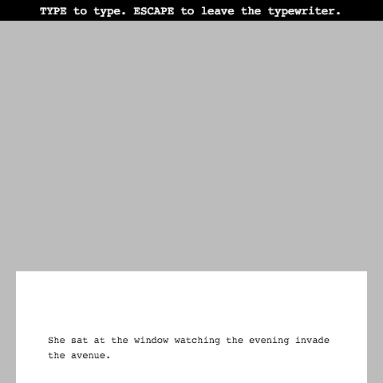
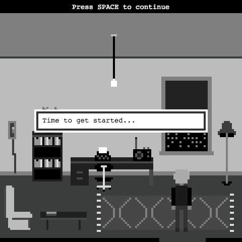
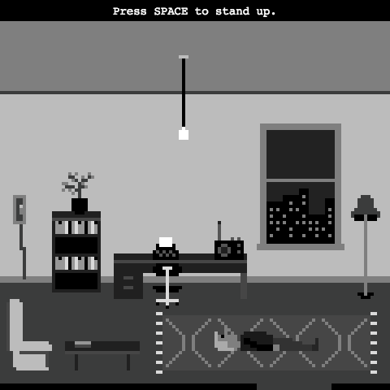
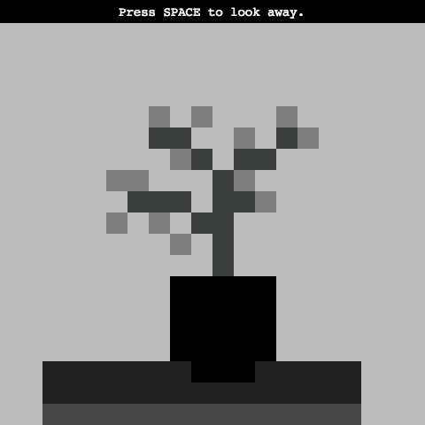
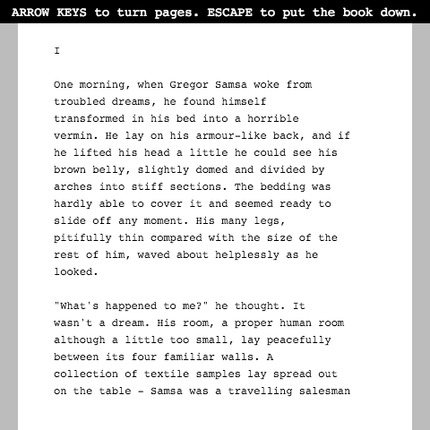
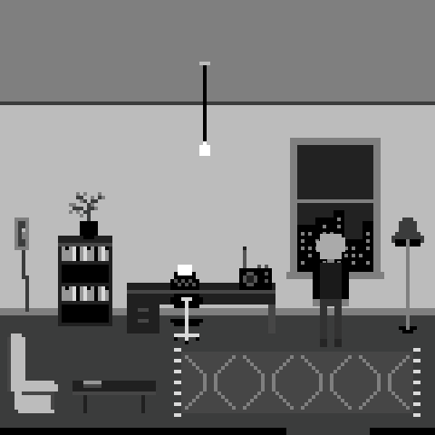

# *Eveline*

## Information
* Released: 23 March 2016
* Website: http://www.pippinbarr.com/
* Platforms: Browser
* Link: https://www.pippinbarr.com/eveline/info
* Price: Free.

## Description
There's a great novelist inside all of us! Especially you! You just need to get started! Write! Read! Write-read! What is that?! Find out!

## History
Eveline was originally put together in 48 hours for the 2016 Global Game Jam, but then took several weeks to resolve into its final form. Mostly that was just by virtue of me being extremely busy over that time, but it was also important to deal with questions such as how the game should end and, frankly, what the game should be called (it was originally 'Writer', which is just so terrible). Now it's done. That's history for you, always over.

## Features
* Writing!
* Reading!
* Kafka!
* Joyce!
* You!

## Images

## Trailer
[View the Trailer on YouTube](https://www.youtube.com/watch?v=sye7D_nUU0Q)

## Credits
* Pippin Barr: Everything
