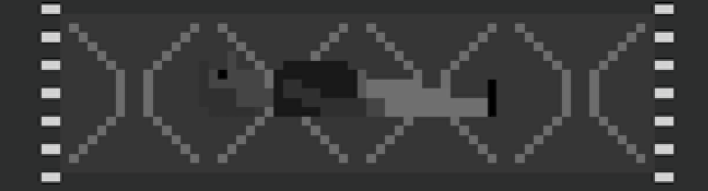

# Blog Posts

Here are public-facing blog posts I wrote about the game.

## Global Game Jam 2016 Post-Mortem (2016-02-01)

The [Global Game Jam](http://globalgamejam.org/) took place over last weekend and I participated at the lab I'm affiliated with at Concordia called [TAG](http://tag.hexagram.ca/). The theme turned out to be "ritual" – a nice theme that, for one thing, led to Michael Brough's important [Vesper.5](http://mightyvision.blogspot.ca/2012/08/vesper5.html) in a different jam. After a false start where I tried to make something based on my notebook drawings (which I will return to), I decided to try to fast-build a version of the project I was planning to work on next about being a novelist/writer. Ritual played in with that whole optimism one feels around deciding that "this time" one is going to get up every morning and work on one's novel etc. etc. Ah optimism. Anyway, my bold idea was to try to compress my usual development time-frame of 2-6 weeks into two days.

Lessons learned, you ask? Well.

_For one thing, it kind of worked_. I did actually finish a version of the full concept in two days. I'm not going to link to it here because I'm going to finish it properly over the next couple of weeks, but if you're desperate you'd be able to find it on the Global Game Jam website (along with its awful, awful source code).

_Awful, awful source code_. Unsurprisingly, when working to a tight deadline, the code was really pretty terrible and was tripping me up a lot by the end. That certainly led to a bunch of problems, including bugs in the final version. That said, it worked remarkably well.

_High-speed design decisions_. Although the project was one I'd had in mind for about a week-ish before the jam, I hadn't really nailed down many of the subtleties. The speed of the game jam both helped and hindered with that. It forced me to confront elements of design I hadn't thought of pre-development, but it also forced me to make snap decisions about them that weren't always particularly true/appropriate to the overall vision for the game. On the other hand the jam version has a "I know what I don't like" quality to it, which is helpful for moving forward.

_High-speed everything_. Perhaps the big learned lesson was just that I can develop something about as sophisticated as my "usual" games in a weekend. But when I think about it, this makes sense anyway. I probably spent in the neighbourhood of 20 hours working on the game. When I consider that I might often put in a couple of hours five days a week ordinarily, that translates to four weeks of work. So it's not that surprisingly in terms of hours, more just that it was possible to compress it so much. But, again, it's pretty clear to me that all the "marination" time I have with the design for a normal project is a major contributor to the coherence of my usual projects – I spend a lot of time thinking about (agonising over) the "truest" way of doing something in a game and that's an important part of what I do.

All up it was a positive experience. It's a bit of a weird feeling to tell myself that a game is "finished" in some capacity (e.g. "for the jam") when it's blatantly not up to my standards, but that's alright. Perhaps the oddest thing was just the decision to not really make a "jam game" at all but a super fast version of my standard practice?

Anyway, look out for the final version later on, when it's, you know, better.

## Get Some Culture In You (2016-03-18)

You may recall I put together a game at the Global Game Jam earlier this year, about writing. I was imaginatively calling it _Writer_ for a while there, for the lack of anything else. It was also _WriteQuest_ and _Write Game_ and other crap, none of which worked. It's a spiritual successor to _Art Game_. It's now called _Eveline_ for reasons I want to go into for a second here (as I try for the billionth time to restart the writing part of my life, how appropriate and not ironic at all).

One thing about _Eveline_ is that a core objective was to "trick" the player into reading a work of literature – in this case the short story, you guessed it, "Eveline" by James Joyce, found in the collection _Dubliners_. The game wasn't conceived specifically around that short story, but more just the general idea of a game in which a core objective was to consume/pay attention to a serious literary work. Originally I had Kafka's "The Metamorphosis" as the text, but it was a bit long to feel like anyone would "sit through it" so I chose something briefer.

I really like this idea of having other works of art inside a game, and importantly the idea of foregrounding them through the way the game works itself. _The Witness_ has a nice example of this: not the movies that play so much, as they seem so separate from the actual play of the game (though full credit for getting Tarkovsky in there), but the timed challenge that includes two movements from Edvard Grieg's "Peer Gynt" ("Anitra's Dance" and "In the Hall of the Mountain King", back to back). Unlike most encounters with game music, here the drama of the music is intimately connected to what you're doing in the sense that it represents the time you have left to solve puzzles. Combine that with the drama of the second piece in particular, and you have this kind of magical integration of play and music that I find to be quite rare (though see also great stuff like _Proteus_ obviously, it's just this version draws on pre-existing "great" music).

So _Eveline_ is perhaps along the same lines, but with the intent to really have the player focused on reading by blurring it with the idea of writing – as you type the story, it appears for you to read. You create and consume it at the same time. It seems to me like there should be more of this kind of thing. Perhaps it's one way around the ways in which videogames often seem so stunted in terms of the kinds of themes and effects of currently existing "great" works in other media. Just steal them...

&nbsp;
